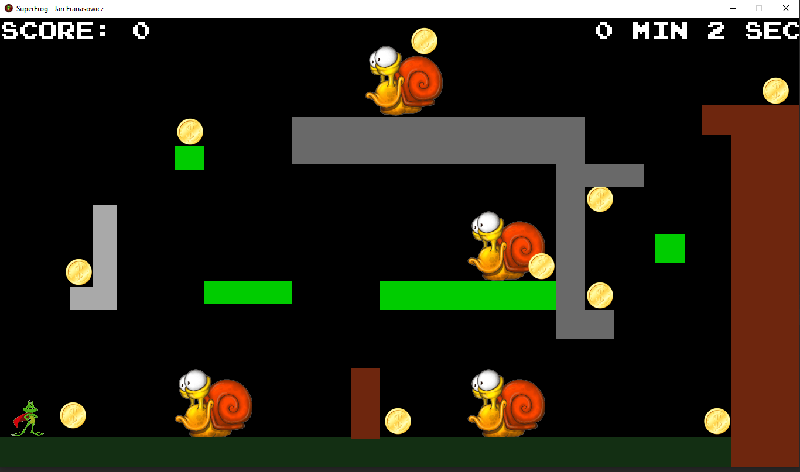

# SuperFrog Remake

The game is a small project in which a frog character, controlled by the player, is implemented. A custom implementation
of gravity, jumping, one type of monster, a time counter, and collected coins has been introduced. The game ends upon
reaching the upper right corner of the game window.

## Contents
- [Technologies](#technologies)
- [Installation](#installation)
- [How to play](#how-to-play)

## Technologies
List of technologies used in the project:
- Python 3.11.4
- Pygame 2.4.0

## Installation
Step-by-step instructions on how to run the game:
1. Unzip the project file into your desired folder.
2. Navigate to the main project folder: `cd superfrog`
3. Install the required packages: `pip install -r requirements.txt`
4. Run the game: use `python superfroggame.py` or `python3 superfroggame.py` for Python 3.x versions.

Note: Ensure that you have Python 3 and pip installed on your system to run the game. The pip package manager is used to install dependencies from the `requirements.txt` file. If Python 3 is not your default Python version, use `python3` command to run the game.

## How to Play

Upon launching, the game's start window will appear:

This window includes instructions on how to control the character:
- A to move left
- D to move right
- Space to jump
You can change your falling direction during a jump using the A and D keys.
Your objective is to avoid monsters (snails) and collect as many points as possible, as quickly as you can.
The timer is located in the top right corner.

After clicking 'start game', you should see the main game window:

Upon reaching the top right corner or being killed by a snail (you can kill them by jumping on them from above, 
but if you touch them from the side, they will kill you), the game's end window will appear. In this window, you can choose whether to end the game or play again. It displays how quickly the player completed the level and how many coins were collected.

